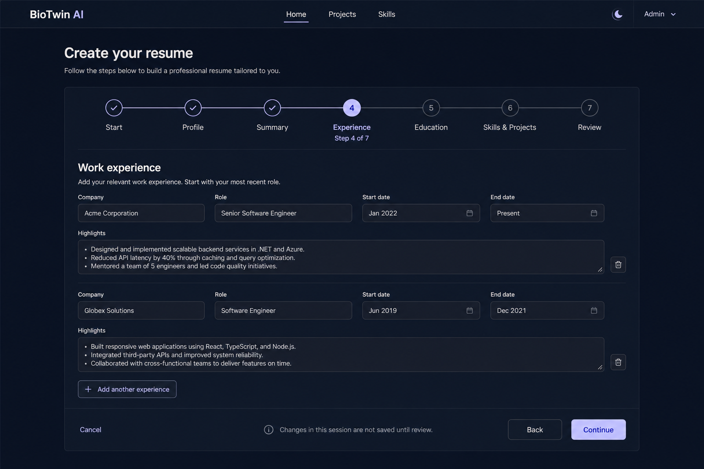

# BioTwin AI Unified Site Layout Design

## Background

BioTwin AI currently mixes centered pages, near-full-screen workspaces, independently floating navigation, and several panel styles. Individual pages control their own widths, spacing, and top offsets, so the site lacks a shared visual baseline and the resume workspace looks disconnected from the public candidate experience.

This redesign uses the Obsidian Glass references under `C:\Tools\stitch_modern_glassmorphism_portfolio` as its visual source. It replaces the current floating pill header and distributed page-width rules with a unified site shell.

## Goals

- Establish a shared Header, content axis, page spacing, and responsive model.
- Align standard pages to one `1200px` content axis.
- Allow the resume workspace to expand to approximately `1600px` within the same site shell.
- Guide users through creating a resume from scratch or an existing file without placing import, entry, review, and advanced editing on one page.
- Unify panels, forms, buttons, menus, and dialogs under the Obsidian Glass visual language.
- Preserve existing routes, authorization, data contracts, and workflows.
- Prevent overlap, overflow, and unusable editor space on desktop, tablet, and mobile.

## Non-Goals

- Do not change the established semantics of canonical resume saving, language uniqueness, section splitting, vector generation, candidate presentation data, or profile-hash updates; only add non-persistent contracts needed to prefill the wizard.
- Do not redesign page information architecture or add business features.
- Do not require every page to use the same internal grid.
- Do not introduce a new frontend framework; continue using the existing Blazor and styling toolchain.
- The first version does not persist incomplete wizard drafts or resume progress across sessions.

## Selected Approach

Use a shared page shell with a wide-workspace modifier. Standard pages share a `1200px` content container, while the resume workspace uses a wide container of approximately `1600px`. Both container types share the Header, background, horizontal safety gutters, top starting point, design tokens, and responsive breakpoints.

This approach balances visual consistency with editor usability. Constraining every page to `1200px` would compress the three-column editor, while allowing every page to choose its own width would preserve the current inconsistency.

## Global Site Shell

`MainLayout` renders the single site shell: theme background, fixed Header, content container, and global dialogs. Pages no longer define global horizontal margins or viewport-relative widths.

The shell exposes two explicit content widths:

- `site-container`: maximum width `1200px`, used by Home, Projects, Skills, Chat, Settings, Resume Library, Upload, Edit, Export, and other standard pages.
- `site-container-wide`: maximum width approximately `1600px`, used by Resume Workspace and other three-column tool surfaces.

Both containers use the same responsive gutters. Desktop gutters are approximately `32px` and progressively reduce to `16px` on narrow screens. Content begins at one consistent offset below the fixed Header.

## Header

The current floating brand block, pill navigation, and hanging-lamp theme control are removed. The new Header follows the Obsidian Glass reference:

- Fixed to the top of the viewport and spans the full page width.
- Uses a translucent background, backdrop blur, thin bottom border, and restrained shadow.
- Its inner content has a maximum width of `1200px`, aligned with standard page content.
- Brand appears on the left; Home, Projects, and Skills appear in the center; theme and account actions appear on the right.
- The active navigation item uses a thin highlight indicator with a smooth transition.
- Signed-out users see a sign-in entry; signed-in users see one consolidated Admin entry.
- The Admin menu contains all protected features and closes after selection, outside click, or completed navigation.

On mobile, the Header retains only the brand, theme button, and menu button. Public navigation, sign-in, and Admin functions share one dropdown panel to prevent top-bar overlap.

## Page Layouts

Standard pages use a shared page-heading area, section spacing, and content grid. Titles, descriptions, actions, and the first content block follow one vertical rhythm instead of redefining top offsets per page.

Candidate information, timelines, and content cards on Home keep layouts suited to their data, but their outer edge aligns to `site-container`. Projects, Skills, Chat, Settings, and resume-management pages share the same heading and panel rules.

Resume Workspace uses `site-container-wide` and keeps the library, Markdown editor, and outline as three columns. Its responsive behavior is:

- Wide desktop: three columns, with the editor receiving most of the space.
- Medium desktop and landscape tablet: narrower sidebars, falling back to the editor plus one supporting column where necessary.
- Portrait tablet and mobile: one ordered column containing library, editor, and outline.

The editor has stable minimum height and width. Toolbars, titles, and dynamic status content must not cause layout shifts.

### Resume Creation Wizard

Initial resume creation and import no longer open directly in the three-column Resume Workspace. They use a step-by-step wizard inside the standard `site-container`. After a canonical resume is saved, the wide workspace remains available for advanced Markdown editing, outline inspection, same-language merging, and re-indexing.

The wizard supports two entry paths:

- `Import existing resume`: upload a Markdown, text, PDF, or Office file; convert and extract its content; then prefill later steps.
- `Start from scratch`: begin with an empty structure and complete it step by step.

Both paths converge on the same seven-step flow:

1. `Start`: choose the creation method and resume language.
2. `Profile`: enter name, contact details, location, and public links.
3. `Summary`: enter professional positioning and career summary.
4. `Experience`: maintain roles and achievement highlights in reverse chronological order.
5. `Education`: maintain education, training, and certifications.
6. `Skills & Projects`: maintain skills, projects, and optional supporting content.
7. `Review`: preview the final Markdown, correct content, and confirm the save.

Navigation is semi-linear. The current step must pass validation before continuing; completed steps may be revisited or clicked; unreached steps cannot be skipped to. Desktop shows a connected horizontal stepper at the top of the wizard panel. Completed steps use check marks, while the current step shows its number, title, and `Step n of 7`. Mobile replaces the seven labels with the current step title, `n / 7`, and one progress bar.

Fully linear navigation and unrestricted step jumping were also considered. Fully linear navigation makes correcting earlier content unnecessarily difficult, while unrestricted jumping makes validation and step dependencies unclear, so neither is selected.

A stable action bar appears at the bottom of the wizard. `Cancel` is on the left, while `Back` and the primary `Continue` action are on the right. The final primary action becomes `Save resume`. Leaving or refreshing a wizard with unsubmitted changes shows a confirmation prompt.

The first version does not save wizard drafts. All step state exists only in the current Blazor session; refreshing, leaving, or closing the page discards unsubmitted content. Only confirmation on `Review` writes the canonical `ResumeEntry`, splits sections, generates vectors, refreshes candidate presentation data, and changes the profile hash.

When a canonical resume already exists for the selected language, final save still enforces one resume per user per language. Imported content first produces an AI merge result and enters the same review steps; final confirmation updates the existing canonical resume instead of creating a second record for that language.

`Review` generates a read-only final resume preview from structured wizard state and provides a route back to the corresponding step for each section. The first version does not embed the full Markdown editor inside the wizard. After saving the canonical resume, the user can open the advanced Resume Workspace to edit Markdown and inspect the outline. This prevents structured fields and hand-edited Markdown from overwriting one another before save.

### Wizard State and Data Flow

The frontend maintains one `ResumeWizardState` for the current session. It contains the creation method, language, profile details, summary, experience, education, skills, projects, current step, and highest completed step. The wizard shell owns navigation and validation, while each step is a focused component that reads and writes only its section.

Blank creation initializes an empty state. File import first reuses the existing conversion API to obtain Markdown and a detected language, then calls a non-persistent structured extraction operation to prefill `ResumeWizardState`. If a canonical resume already exists for that language, the flow first reuses AI merge preview to combine canonical and imported Markdown, then extracts wizard fields from the merged result.

If structured extraction fails, the converted Markdown remains in the current session and the user can retry or continue from blank fields. Step validation errors appear only on the current step. If final save fails, the complete in-memory state and current step remain available for correction or retry.

`Review` deterministically generates Markdown from the structured state. On confirmation, the frontend calls the existing canonical save flow; the backend performs same-language create or update, section splitting, vector generation, candidate presentation refresh, and profile-hash update. Wizard APIs do not write to the database before final save.

Approved desktop visual preview:

## Visual System

Design tokens centrally define backgrounds, surfaces, text, borders, accent colors, shadows, radii, spacing, and control heights. The dark theme uses low-saturation near-black and ink-blue backgrounds; the light theme uses cool white and pale violet-gray surfaces. Both themes maintain sufficient text and control contrast.

Glass treatment is reserved for clearly bounded Headers, menus, dialogs, and content panels. Page sections are not wrapped in unnecessary floating cards, and decorative cards are not nested.

Duplicate visual rules from `tool-panel`, `mac-window`, `glass-card`, and `mica-panel` converge on a shared panel foundation. Semantic classes may remain, but they no longer define conflicting radii, backgrounds, and shadows.

Buttons, inputs, selects, and textareas use consistent heights, font sizes, and vertical alignment. Primary, secondary, destructive, and text commands have clear and consistent states.

## Dialogs and Menus

Sign-in, registration, and profile-edit dialogs use the same Obsidian Glass window structure. Input and button heights remain balanced, and content grows naturally between modes instead of relying on an oppressive fixed height.

The Admin menu is visually continuous with the Header and uses clear grouping, hover, and focus states. Its backdrop captures outside clicks without blocking menu items or page navigation.

## Interaction and Accessibility

- The fixed Header does not cover anchors, page titles, or focused elements.
- All buttons and menu items retain visible keyboard focus states.
- Menu buttons expose their expanded state and menus have accessible names.
- Navigation indicator, panel hover, and background animation are reduced or disabled under `prefers-reduced-motion`.
- Text, buttons, and labels do not clip or overlap at supported viewport sizes.

## Implementation Boundaries

Primary changes are limited to:

- `Layout/MainLayout.razor`: new Header and container structure.
- `Layout/MainLayout.razor.css`: fixed Header, container widths, and mobile navigation.
- `wwwroot/css/app.css`: design tokens, shared panels, forms, and page rhythm.
- Page Razor files: add explicit standard or wide layout markers and remove wrappers that conflict with the global shell.
- Resume creation frontend: split creation method, stepper, step forms, in-session state, and final review into focused wizard components; keep the advanced Markdown workspace separate.
- Shared contracts: add a structured `ResumeWizardDto` and non-persistent Markdown-to-wizard extraction request and response; final save continues using the existing canonical resume save contract.
- Related component tests: update assertions for the Header, Admin menu, and page containers.

No existing pages are removed and no API calls are changed.

## Verification Strategy

- Build the Blazor Client and run the existing frontend tests.
- Inspect the Header and menus while signed out and under Candidate, Interviewer, and Admin sessions.
- Verify that the Admin menu closes after item selection, outside click, and route changes.
- Inspect Home, Projects, Skills, Chat, Settings, Resume Library, and Resume Workspace.
- Check content axes, fixed Header behavior, text overflow, and interaction areas at desktop, tablet, and mobile viewport sizes.
- Check three-column, two-column, and one-column Resume Workspace states and confirm the Markdown editor remains usable.
- Check both blank creation and file-import wizard paths and confirm imported content prefills the same steps.
- Check semi-linear navigation, step validation, backward editing, unsaved-leave confirmation, and mobile progress presentation.
- Confirm that no canonical resume, sections, vectors, or profile hash changes are written before `Review` confirmation.
- Check structured extraction, extraction after same-language merge preview, extraction retry, and preservation of in-memory state after final-save failure.
- Check contrast, borders, glass treatment, and focus states in both themes.

## Acceptance Criteria

- Standard-page edges, Header content, and page headings align precisely on desktop.
- Resume Workspace is visibly wider while sharing the same Header, background, gutters, and visual system.
- Resume creation uses a seven-step wizard that presents only the content and actions required for the current step.
- Import and blank creation share one step model; only final confirmation saves and triggers indexing and profile-hash changes.
- The old floating brand block, pill navigation, and hanging-lamp theme switch are absent.
- All visible panels use consistent radii, borders, and surface treatment.
- Header controls and page content do not overlap on mobile.
- Existing authentication, navigation, resume editing, and public candidate viewing flows continue to work.
- The frontend build and relevant automated tests pass.
